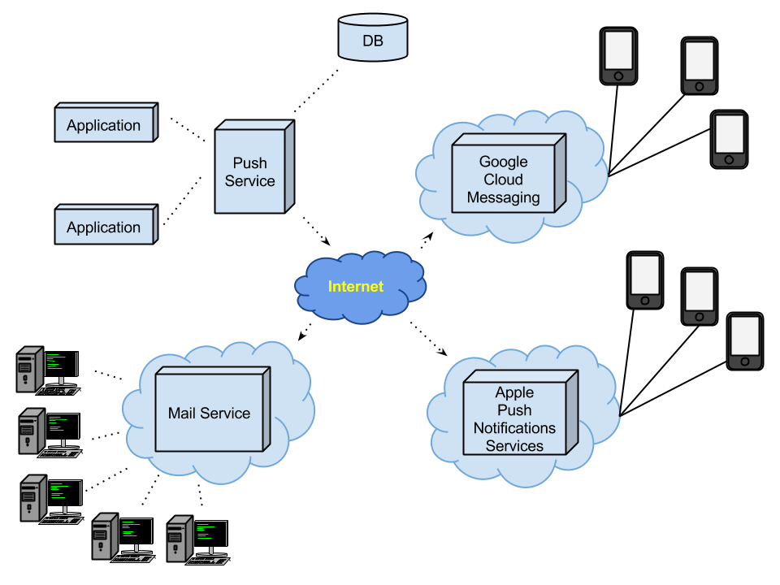

# PushApi (Degree project)

> This is a hudge project that it is growing during a final degree project. Once finished, it will be able to accept external contributions.

## Target

The project will have two basic targets:

### Email

The basic notification also called as SPAM it is done trought via email adress. This API will send all mails you want without the necessity of rent foreign services. It is expected to send mails via [crontab](http://unixhelp.ed.ac.uk/CGI/man-cgi?crontab+5) during a period of time (it will be a slow process but it will use the process capacity of our server).

### Smartphones

The first target of this project is send push notifications to smartphones (firstly Android and iOs) via the oficial servers GCM ([Google Cloud Messaging](https://developer.android.com/google/gcm/index.html)) and APNS ([Apple Push Notification Service](https://developer.apple.com/library/ios/documentation/NetworkingInternet/Conceptual/RemoteNotificationsPG/Chapters/ApplePushService.html)).
Sending multiple notifications through Android it's not difficult because GCM lets you send arrays of users and it will send the notifications using a customized [Token bucket](http://en.wikipedia.org/wiki/Token_bucket). Otherwise, APNS also lets to send multiple notifications to various devices at the same time.

This is a possible scheme of what the project wants to be:

# Prerequisites
- Apache2
- MySQL
- Redis
- PHP 5.5+ (PHP 5.5 recommended)
- [Medoo](http://medoo.in/) 0.9.6.2 (Medoo is requiring PHP with PDO supported)

# Contact
If you want to contribute with information or resources, you can send information to eloi@tviso.com

Thank you.