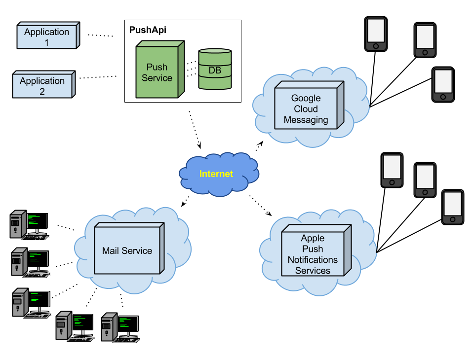
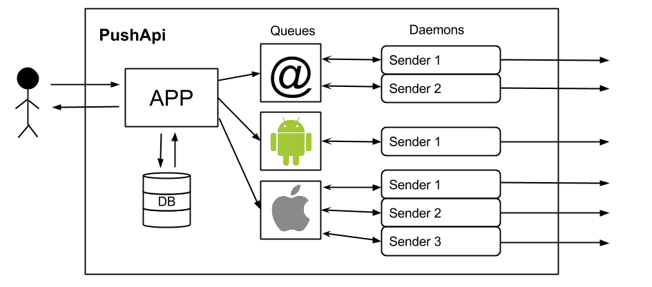
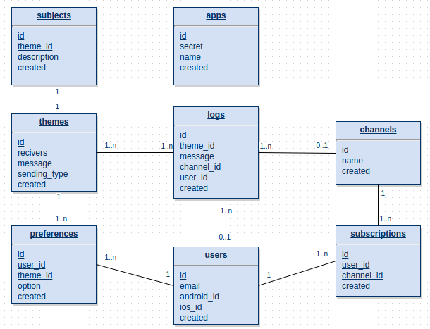

# PushApi 

The PushApi is a server side project using PHP. It provides a way to notify users of different kind of events. There is the possibility to send notifications using unicast (target user), multicast (interested group) or broadcast (all users).

> It is being tested in a real system and it is obtaining the goals for which Pushapi was designed for.
- It is being tested handling a database of more than 400k users.
- It is sending an average of 50k daily mails.
- The same values than before with android smartphones.

## Index

  - [How it works](#how-it-works)
  - [Targets](#targets)
    - [Email](#email)
    - [Smartphones](#smartphones)
    - [Chrome](#chrome)
    - [Twitter](#twitter)
  - [Schemes](#schemes)
    - [General view](#general-view)
    - [Inside the API](#inside-the-api)
    - [DataBase](#database)
- [Used tools](#used-tools)
- [Client](#client)
- [Workers](#workers)
- [Comments](#comments)
- [Wiki](#wiki)
- [Support](#support)
- [TODOs](#todos)

### How it works

The API has an internal database (the tables will be described in the database scheme [DataBase](#database)).
In order to receive events, users must be registered into the API and then they can be subscribed into different Themes (this themes will be set by the administrator of the API). When user subscribes into a new Theme, user can choose where he wants to receive the notification (mail, smartphone, all, ...), by default, notifications will be sent via all the devices in order to force him to set its preferences.
The multicast Themes are assigned to different Channels that users can also subscribe.

When a notification is sent, API always returns the result directly to the client but it will send the notification when it can. For each target it has a Redis queue that sends step by step the different notifications that are being added continually to the various queues (soon it will be added [Forever](http://github.com/nodejitsu/forever) in order to ensure that a given script runs continuously).

You can also read the [wiki](https://github.com/watzenare/PushApi/wiki) documentation if you want to know more about the PushApi.

### Targets

The API is being developed in order to support all kinds of targets if all these targets are configured correctly but the initial expected targets that is wanted to reach before the end of this project are the following ones:

#### Email

The basic notification method it is done via email (sometimes is called as SPAM due to its bad use). This API will send all mails to subscribed users without using external mailing services.

#### Smartphones

The other targets of this project are the most used smartphones (mainly Android and iOs) using the official servers for each company:
- GCM ([Google Cloud Messaging](https://developer.android.com/google/gcm/index.html)).
- APNS ([Apple Push Notification Service](https://developer.apple.com/library/ios/documentation/NetworkingInternet/Conceptual/RemoteNotificationsPG/Chapters/ApplePushService.html)).

Both servers let sending notifications to various users with only one message. That is an advantage against the mail service.
At the beginning it was proposed to send notifications directly to the different smartphones without using the official services but the idea was deprecated because the lack of time and experience were a fisic solid wall.

#### Chrome

With Chrome you can receive notifications from an application or an extension that you have installed. So far, Chrome Push Notifications was available only for PC but recently, it has been introduced for smartphone browsers. This is a good advantage for companies that doesn't want to use native applications. With smartphones, you can get the same notifications that you could receive with a native application.

#### Twitter

This is a new target that has been proposed during the project but it won't be applied until the main targets are finished. The purpose of this target is to make a Twitter tweet mentioning the target users interested on receive the notifications.

[Back to index](#index)

### Schemes

The following schemes wants to be descriptive parts of the project in order to make it easier to understand how it works or what is its functionality.

#### General view

This is the scheme of what the project will support with the basic targets.

#### Inside the API

The following figure shows how the API is structured internally and what the client can see.

From left to right:
- an agent has a PushApi app created and it can use the API calls (each call can check the API database).
- once the app receives a send call, it checks the users that can receive the notifications and sort all of them by its preference (email, android, ios), then it stores the sending information into the queue that should go and returns a response to the agent.
- internally, the server has senders that are running all the time sending the messages that are being stored into the queues. Each queue has a different worker and it can be set a determinate number of daemons running that workers.

#### DataBase

The current MySQL tables used are the following ones:

- Agent, it stores the apps that are being created.
- Users, all the users that will use the service are stored in here, it is only stored its receive identifications.
- Themes, the different themes that are established for the notifications.
- Preferences, foreach theme an user can set its preferences in order to choose how he wants to receive the notification.
- Channels, groups that users can follow in order to get customized notifications.
- Subscriptions, users that wants to receive channel notifications should be subscribed before.
- Logs, a sending log that is stored each time a send request is done in order to register the call params request.
- Subjects, the themes names could not be good names for sending as mail subjects and this table contains a customizable translation (example: user_comment => User has commented your profile).

There are also 3 Redis Lists used in order to queue the notifications before send them properly (one list for each possible destination).

[Back to index](#index)

## Used tools

+ System requirements
 - MySQL
 - Redis
 - PHP 5.5+ (PHP 5.5 recommended)

+ Framework
 - Slim Framework used as squeleton of the API
 - [Eloquent](http://laravel.com/docs/5.0/eloquent) ORM from the Laravel Framework
 - [Forever](http://github.com/nodejitsu/forever) externally of this project in order to test the [Workers](#workers)

[Back to index](#index)

## Client

In order to use the API more easily, there are diferent standalone Clients that facilitates the use of the PushApi by using diferent languages. You can find your Client at the following points:

- PHP: [PushApi_Client](https://github.com/watzenare/PushApi_Client)
- Python: pending...
- Java: pending...

Currently there is only the PHP Client but soon there will be more. Also you can create your own (i.e. Python Client).

[Back to index](#index)

## Workers

The workers folder contains the scripts that are used to send the notifications to the diferent target devices.
The job of each worker is:
 - Checks its target queue in order to get the pending notifications
 - Retrives the data and prepares the message
 - Sends the message to the given target

When the queue is empty the worker is waiting to a new entry but this can fail while is running and it is recommended to use some service to keep the workers running.

For example, here are some recommended services that will keep all your workers alive:
 - [Forever](http://github.com/nodejitsu/forever)
 - [Supervisor](http://supervisord.org)

> It is not recommended to use the crontab to run the workers.

[Back to index](#index)

## Wiki

To see more information about the PushApi you should check the [wiki](https://github.com/watzenare/PushApi/wiki).

[Back to index](#index)

## Support

If you want to give your opinion, you can send me an [email](mailto:eloi@tviso.com), comment the project directly (if you want to contribute with information or resources) or fork the project and make a pull request.

Also, I will be grateful if you want to make a donation, this project hasn't got a death date and it wants to be improved constantly:

[Back to index](#index)

## TODOs

You are free to help with them:

- Be able to store more than one smartphone token per user (an user can use more than one android/ios device and it is only stored one token per user).
- Add 'collapse_key' param when sending a notification in order that pushapi sends more than one of that theme.
- Create a *plugin system* that would interact with the sending system and depending of the plugin would able to filter messages or whatever the plugin does. Developers will be able to create plugins. The target of this system is to avoid modify the base structure of the PushApi.
- Unit testing (do mock objects simulating the DB and checking the routes and controllers).
- To log most of the functionalities.
- Add multilevel security (One App to rule them all).

[Back to index](#index)

Thank you!